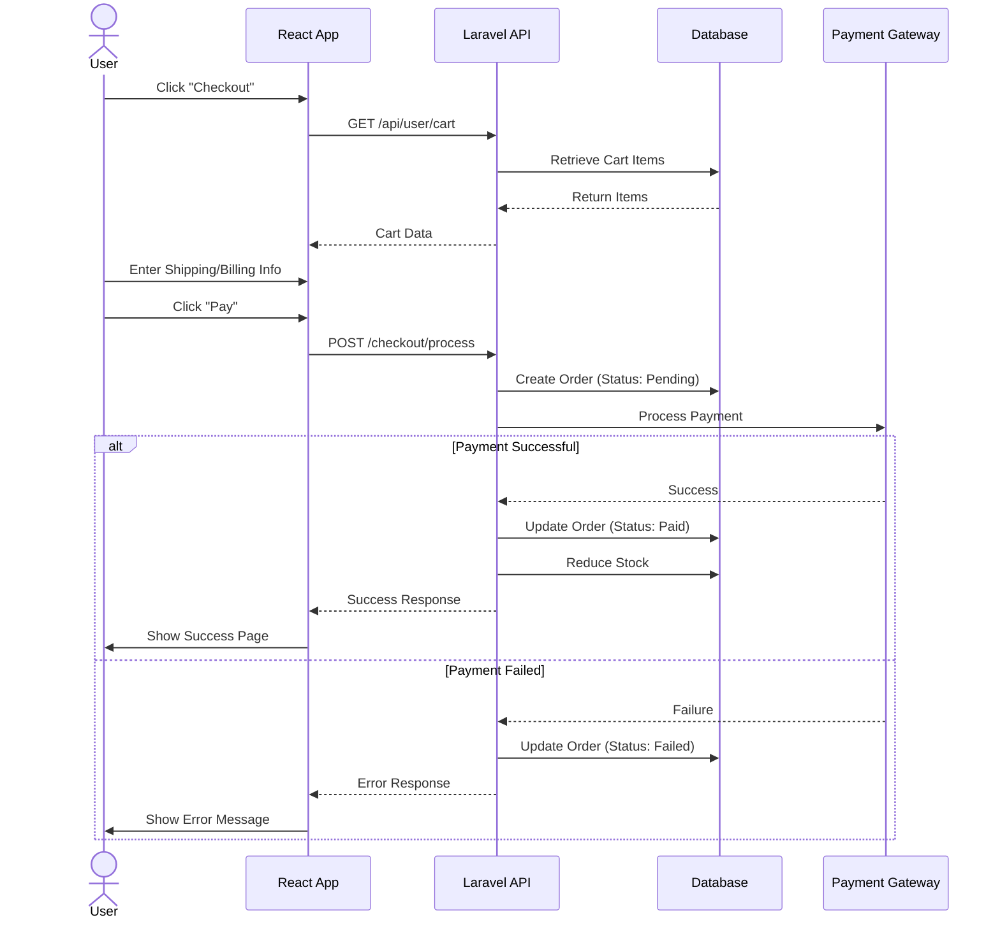
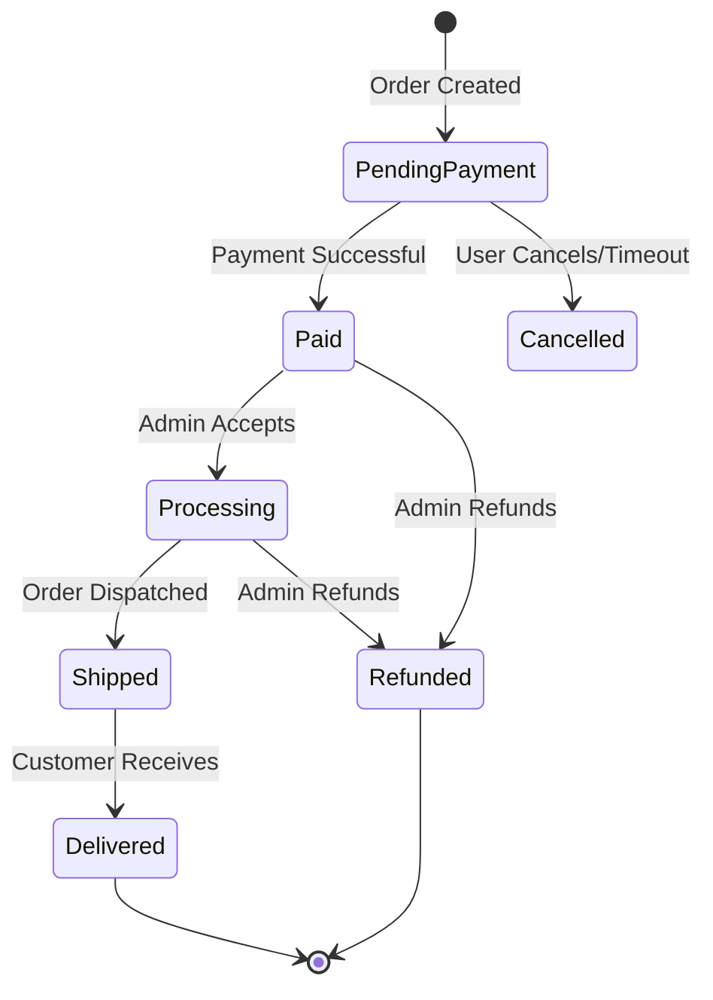
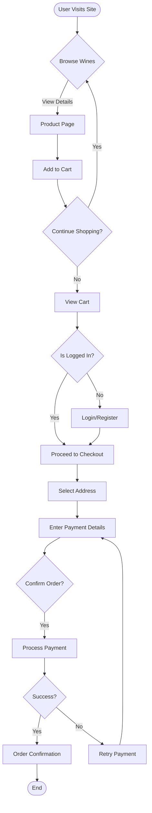
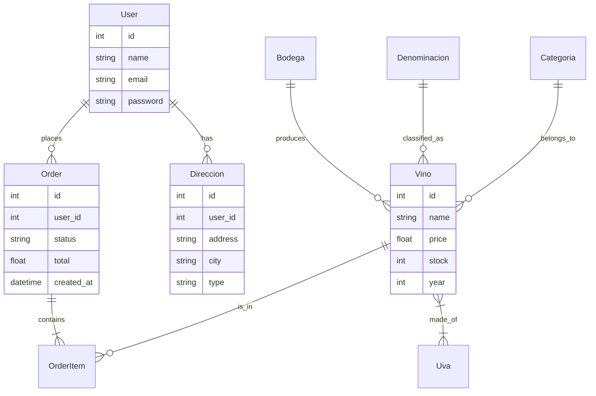

# System Diagrams

## 1. Data Flow Diagram (DFD) - Level 0
Overview of data movement in the Pago Jotron system.

```mermaid
graph TD
    User[User/Customer] -->|Browse Wines, Add to Cart| Frontend[Frontend (React)]
    Frontend -->|API Requests| Backend[Backend (Laravel API)]
    Backend -->|Read/Write| DB[(Database)]
    Backend -->|Auth Token| Frontend
    User -->|Checkout & Payment| Frontend
    Frontend -->|Process Order| Backend
    Backend -->|Payment Info| Gateway[Payment Gateway]
    Gateway -->|Payment Status| Backend
    Backend -->|Email Confirmation| Email[Email Service]
    Admin[Admin User] -->|Manage Products/Orders| Backend
```

## 2. Sequence Diagram - Checkout Process
Detailed interaction during the checkout phase.



## 3. State Diagram - Order Status
Lifecycle of an order within the system.



## 4. Activity Diagram - User Purchase Flow
The step-by-step workflow of a user making a purchase.



## 5. Entity-Relationship Diagram (ERD)
Core database structure and relationships.


